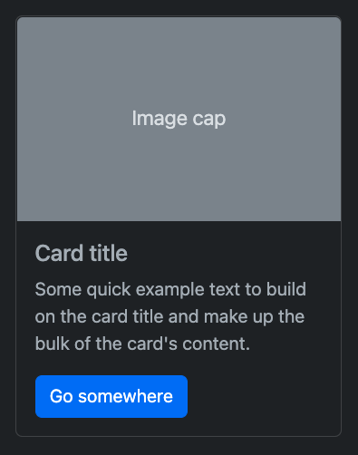
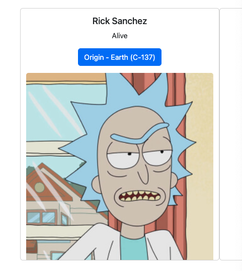
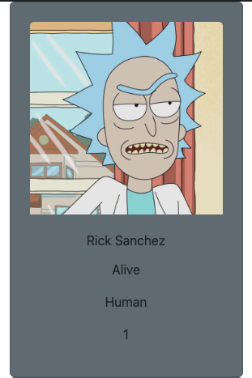

# Personal Log

# 01/15/2023

I've been keeping track of how I build my projects as a reminder of what I tried and how I fixed it. This file will keep track of the bugs that I remember so far from this project. These bugs where not found on the date that is written on the title of this section. I'm just re-writing them down and sort of doing a deep-dive on them so I can remember how I fixed and why that fix worked.

# Bug #001 - In trying to recreate it, I fixed it.

A few weeks back a fellow from my cohort had an idea of creating 95% of the html elements on the `main.js` file and then render/append them to the DOM. This worked fine for that specific project we worked on but I believe when we introduce Bootstrap to `this` project something breaks. I will try to recreate the bug and log the results.

```html
<!-- contents of the index.html file -->

<!-- code inside the body -->
<div class="container align-items-center">
  <div class="mainContainer">
    <div class="row text-center row001">
      <!-- inside here would be other divs that I would have created in the js file then rendered them back here -->
    </div>
  </div>
</div>
```

The goal of this project was to create a website that made a call to an API and render the results from said API call to the DOM. Because of the limited amount of calls I can make to the API I specifically choose for this project I will be using the [Rick and Morty API](https://rickandmortyapi.com/) to recreate the bug.

I wanted to display images on my page so both the API I chose for this project and the Rick & Morty API have images so there is no issue with that. Next I wanted to render those images inside a [Bootstrap Card](https://getbootstrap.com/docs/5.3/components/card/)

```js
// contents of the main.js file
const url = "https://rickandmortyapi.com/api/character/[1,2,3]";

const mainContainer = document.querySelector(".row001");

fetch(url)
  .then((characters) => characters.json())
  .then((characters) => {
    console.log(characters);
    landingPage(response);
  })
  .catch((error) => console.log(error));
```

Just for testing purposes I double check what I'm getting back from the API call. First I will check with [Postman](https://www.postman.com/). After I do that I will check the API with the browser.

## Checking API response with Postman


## Checking API response on the browser


---

## Creating the Bootstrap Cards in the `main.js` file

```js
function landingPage(characters) {
  characters.forEach((character) => {
    const { id, name, status, species, gender, image } = character;
    const card = document.createElement("div");
    card.classList.add("card", "col-md", "p-4", "bg-secondary", "mx-auto");
    card.style.width = "18rem";

    const img = document.createElement("img");
    img.classList.add("card-img-top");
    img.src = image;

    const cardBody = document.createElement("div");
    cardBody.classList.add("card-body");

    const cardTitle = document.createElement("h5");
    cardTitle.classList.add("card-title");
    cardTitle.textContent = name;

    // Line below may have been the culprit of bug #001
    card.append(img, cardBody, cardTitle);

    mainContainer.append(card);
  });
}
```

# It works!

It seems in my effort to recreate the bug I may have fixed it. Almost all the parameters and conditions are the same but different results were obtained. I will keep this in mind for future projects.

### Possible Solutions that may have fixed this particular bug.

- I noticed that in my original file where I found the bug, I had two cdn links for BootStraps's CSS. I removed one of them.
- It may be also that when trying to replicate this bug I forgot to append the contents made in the `main.js` file to the div that was already in the `index.html` file. So if I forgot to append them here. Then most likely I forgot to append them before. Hence causing the bug.


# Bug #002 - `ForEach()` vs. `ForLoop()`

I'm a bit hesitant to go into this bug since the first bug sort of disproves it. But I will still write it down because it did allow me to learn a few things like the difference between `forEach()` and `forLoop()`.

P.S. I will point out that this next bug happened with the `divs` already in the `index.html` file. I did not create them in the `main.js` file. So I may need to recreated it with the `divs` created in the `main.js` file. We shall see. Come along for the ride.

```html
<div class="col-md card p-4 bg-secondary mx-auto" style="width: 18rem">
  
  <div class="card-body">
    <div class="bg-dark rounded p-1">
      <p class="card-title p0"></p>
    </div>
    <p class="card-text p1"></p>
    <p class="card-text p2"></p>
    <p class="card-text p3"></p>
    <a href="#" class="btn btn-dark">Go somewhere</a>
  </div>
</div>

<div class="col-md card p-4 bg-secondary mx-auto" style="width: 18rem">
  
  <div class="card-body">
    <div class="bg-dark rounded p-1">
      <p class="card-title p0"></p>
    </div>
    <p class="card-text p1"></p>
    <p class="card-text p2"></p>
    <p class="card-text p3"></p>
    <a href="#" class="btn btn-dark">Go somewhere</a>
  </div>
</div>

<div class="col-md card p-4 bg-secondary mx-auto" style="width: 18rem">
  
  <div class="card-body">
    <div class="bg-dark rounded p-1">
      <p class="card-title p0"></p>
    </div>
    <p class="card-text p1"></p>
    <p class="card-text p2"></p>
    <p class="card-text p3"></p>
    <a href="#" class="btn btn-dark">Go somewhere</a>
  </div>
</div>
```

The following will be a copy and paste from the previous `readme.md` file I created:

On the night of January 9th, 2023 around 10pm I started to have an idea of displaying cards on my front-end-porfolio project. Learning Bootstrap was sort of easy. I read some of the documentation provided on their site while also watching a YouTube video explaining how to use BootStrap properly.

## Here is an example of their default card:



# While trying to recreate the bug I fixed it.

Technically this was not a bug but a foolish mistake on my part. With the `html` code provided above I had this in my `main.js` file:

```js
// returns a NodeList of all the divs with the class of "card" in this case there are 3
const cards = document.querySelectorAll(".cards");

// since I know there are three results from the API call I will now use a forEach loop to iterate throught the cards.
cards.forEach((card, index) => {
  const { id, name, status, image, species } = characters[index];

  const imgTop = card.querySelector(".card-img-top");
  imgTop.src = image;
  imgTop.alt = name;

  // my first mistake was adding the following line of code
  // card.append(imgTop);

  const cardBody = card.querySelector(".card-body");

  // the line below and the line after do the same thing
  const cardTitle = card.querySelector(".card-title");
  // const cardTitle = cardBody.querySelector(".card-title");

  cardTitle.textContent = name;

  const p1 = card.querySelector(".p1");
  p1.textContent = `Status: ${status}`;

  const p2 = card.querySelector(".p2");
  p2.textContent = `Species: ${species}`;

  const p3 = card.querySelector(".p3");
  p3.textContent = `ID: ${id}`;

  // the lines below was in the original code which again is the culprit of the so called bug
  // cardBody.append(cardTitle, p1, p2, p3);
  // mainContainer.append(card);
});
```

I believed the culprit for the bug was the use of `forEach()` instead of a `forLoop()`. I was wrong. The culprit was the line of code that I commented out. I was appending elements back to the card when they were already there. All I was doing here in the `main.js` was updating their content. There was no need to appened them again which would result in something I thought was a bug.

## Here is what it looked like



But after thinking about how to recreate the bug I found my mistake and fixed it. Here is what it looks like now:

```js
const cards = document.querySelectorAll(".cards");

cards.forEach((card, index) => {
  const { id, name, status, image, species } = characters[index];

  const imgTop = card.querySelector(".card-img-top");
  imgTop.src = image;
  imgTop.alt = name;

  const cardBody = card.querySelector(".card-body");
  const cardTitle = card.querySelector(".card-title");
  cardTitle.textContent = name;

  const p1 = card.querySelector(".p1");
  p1.textContent = `Status: ${status}`;

  const p2 = card.querySelector(".p2");
  p2.textContent = `Species: ${species}`;

  const p3 = card.querySelector(".p3");
  p3.textContent = `ID: ${id}`;
});
```

## Here is what it looks like. The CSS might be a lil off



## Another way to tackle this might be using a `forLoop()`

```js
const cards = document.querySelectorAll(".cards");

for (let i = 0; i < cards.length; i++) {
  const { id, name, status, image, species } = characters[i];

  const imgCard = cards[i].querySelector(".card-img-top");
  imgCard.src = image;
  imgCard.alt = name;

  const cardBody = cards[i].querySelector(".card-body");
  const cardTitle = cardBody.querySelector(".card-title");
  cardTitle.textContent = name;

  const p1 = cards[i].querySelector(".p1");
  p1.textContent = status;

  const p2 = cards[i].querySelector(".p2");
  p2.textContent = species;

  const p3 = cards[i].querySelector(".p3");
  p3.textContent = id;
}
```

# 01/16/2023

Today I will add the functionality for the

# Resources

[Testing an API with Postman](https://circleci.com/blog/testing-an-api-with-postman/)
